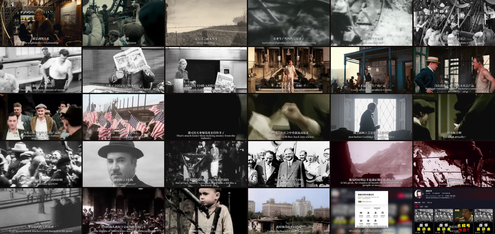
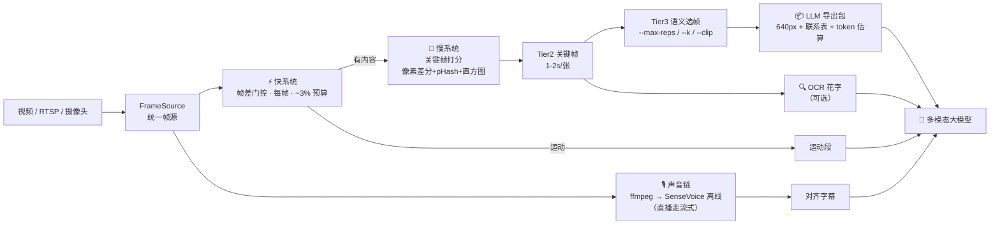

<div align="center">


**English** · [简体中文](README-CN.md) · [SKILL.md](SKILL.md) · [性能基准报告](bench/performance-test-results.md)

[](https://github.com/CommitStrip/video-understanding-skill/actions/workflows/ci.yml)
[](LICENSE)
[](https://github.com/CommitStrip/video-understanding-skill/tags)
[](https://github.com/CommitStrip/video-understanding-skill/actions)

**把视频压缩成 LLM 读得懂的样子 · Compress video into what an LLM can actually read**

</div>

---

vus 把 30fps 的原始视频（十几万帧）压缩成**语义代表帧 + 时间轴对齐字幕 + 运动段**，让多模态大模型不漏关键地读懂一段视频。同一套架构既支持**文件离线转写**（默认离线 SenseVoice 全上下文识别，A 级中文可读性），也支持 **RTSP/摄像头直播**（流式识别 + 触发式 VLM 滚动理解，延迟有界）。

<div align="center">

<br/><sub>▲ vus 管线真实输出——11 分钟抖音解说视频的 30 张语义代表帧（Tier3，--max-reps 30）</sub>
</div>

## ✨ 核心特性

- **实时预算分配**——快系统（逐帧运动门控，约占 3% 预算）触发慢系统（低频关键帧 + 触发式重活）。能直接跑在机器人/边缘设备上，不只是文件回放。
- **直播理解**——`vus.live`：四层栈，毫秒级本地打标 + 触发式 VLM 滚动理解（成本可控旋钮）+ SSE 状态服务，为机器人实时视觉而生。
- **实时源**——视频文件 / 摄像头 / RTSP 流统一 `FrameSource` 接口；RTSP 带最新帧背压、断流自动重连、单调时钟时间戳。
- **三层压缩**——原始帧 → 镜头级关键帧 → 语义代表帧，解决"镜头切换 ≠ 内容变化"的冗余问题。
- **渐变演化不丢帧**——课件批注推进、镜头缓摇这类缓慢内容演化，由漂移确认机制（硬窗口 + 持续软车道）捕获，不再只认硬切换。
- **双语 ASR 双通道**——文件转写默认走 SenseVoice int8 离线模型（全上下文解码，A 级可读性，对 BGM 鲁棒）；直播音频走流式 zipformer 通道（词级时间戳）。模型缺失时显式降级、绝不静默造假。
- **LLM 友好导出**——代表帧自动缩放到 640px + 3×3 联系表拼图 + token 预算估算，跑之前就知道上下文成本。
- **可选语义增强**——CLIP（ONNX，不依赖 PyTorch）语义选帧；OCR 通道提取内嵌文字。
- **可安装、有测试**——`pip install -e .`，200+ pytest 用例，GitHub Actions CI。

## 📦 安装

```bash
pip install -e .                 # 核心（opencv-python + numpy）

# 可选 extras
pip install -e ".[asr]"          # sherpa-onnx ASR（真字幕）
pip install -e ".[clip]"         # CLIP 语义选帧（ONNX）
pip install -e ".[ocr]"          # OCR 通道
```

模型权重不入库；首次使用所需模型会自动从 sherpa-onnx 官方 release 下载：

| 通道 | 模型 | 体积 | 何时下载 |
|------|------|------|---------|
| 文件转写（默认） | SenseVoice int8（中英，离线） | ~166MB | 首次跑管线 |
| 直播音频（RTSP/摄像头） | 流式 zipformer（中英） | ~490MB | 首次直播运行 |
| CLIP 语义选帧（可选） | ViT-B/32 ONNX | ~600MB | `--clip` / 下载脚本 |

<details>
<summary>⏬ 手动下载 / 关闭自动下载 / 自定义模型目录</summary>

设 `VUS_ASR_AUTO_DOWNLOAD=0` 可关闭自动下载；模型目录可用 `VUS_SHERPA_MODELS` /
`VUS_OFFLINE_ASR_MODELS` / `VUS_CLIP_MODELS` 覆盖；手动下载示例：

```bash
mkdir -p models/sherpa
curl -L -o - https://github.com/k2-fsa/sherpa-onnx/releases/download/asr-models/sherpa-onnx-streaming-zipformer-bilingual-zh-en-2023-02-20.tar.bz2 \
  | tar -xj -C models/sherpa --strip-components=1
bash scripts/download_clip_onnx.sh   # CLIP ONNX
```
</details>

> ⚠️ 未下载模型时字幕通道退化为 **mock 占位输出——是假文本，不是真实转写**。严禁把 mock 字幕当作真实内容交付。

## 🚀 快速开始

```bash
# 1. 提取结构化产物（关键帧 + 运动段 + 字幕）
#    文件转写默认走离线 SenseVoice 通道
python -m vus.integrated_pipeline --video lecture.mp4 --output out/ --kf-hz 1.5

# 带 OCR（只对 Tier3 代表帧执行——不进逐帧路径）
python -m vus.integrated_pipeline --video lecture.mp4 --output out/ --ocr

# 2. 压缩为语义代表帧（Tier 3）并导出 LLM 包：
#    640px 缩放帧 + 3×3 联系表 + token 估算
python -m vus.select_representatives --keyframes out/keyframes \
  --max-reps 60 --llm-export out/llm --out representatives.json --report context.md

# 多人近景轮换（圆桌/访谈）？保留桶内多样性：
python -m vus.select_representatives --keyframes out/keyframes \
  --interval 60 --k 3 --out representatives.json

# 3. 把 out/llm/ 图片 + context.md + aligned_output.json 交给多模态大模型，
#    生成课程讲义 / 剧情摘要 / 场景分析报告
```

## 📡 直播理解：边看边懂（v0.4）

离线管线解决"把一段视频压缩给 LLM 读"；`vus.live` 解决"直播流进来，LLM 边看边懂"。四层理解栈，每层按自己的物理极限跑满：

| 层 | 输出 | 延迟 | 成本 |
|----|------|------|------|
| T0 帧级反射 | 运动事件 + 运动框 | 0ms（单帧 ~1.6ms） | 零（快系统） |
| T0.5 语义标签 | 人脸/运动强度等即席标签 | 毫秒级/帧 | 零（本地，无模型下载） |
| T2 滚动理解 | 当前摘要/时间线/实体 | 滞后有界（VLM 延迟 + 触发间隔） | 按调用计费，触发式 + 地板间隔控制 |

> 毫秒级语义由 T0+T0.5 承担；富语义理解受 VLM 推理延迟的物理下限约束，架构保证是**滞后有界、永不增长**——VLM 在跑时素材只累积不排队（单飞合并），完成后下一窗取合并后的最新。

```bash
# 文件仿真实时（开发与验收默认路径；mock 后端零成本跑通全链）
python -m vus.live --video lecture.mp4 --realtime --vlm mock --serve

# RTSP 直播 + 真实 VLM（OpenAI 兼容 env：VLM_API_BASE / VLM_API_KEY / VLM_MODEL）
python -m vus.live --source rtsp --url rtsp://host/stream --vlm openai --serve

# 纯本地免费模式（只跑 T0+T0.5，零 API 成本）
python -m vus.live --video x.mp4 --realtime --vlm off --serve
```

<details>
<summary>💰 成本旋钮与结果消费方式</summary>

成本旋钮：

- **触发式调用**——场景切换 / 长运动段闭合 / 新语音段才发起，安静场景零调用；
- **地板间隔** `--min-call-interval`（默认 8s）——最坏费用上限 = 时长 ÷ 间隔 × 单次成本；
- **单次调用瘦身**——最新 1-2 张 448px 关键帧 + 增量语音文本 + 压缩运动统计；
- `--vlm off` 完全不调用。

理解结果三路消费（可同时）：

- **滚动文件**——`live_state.json`（机器可读）+ `live_context.md`（人/agent 可读），原子落盘，任何 agent 任何时刻读文件即得当前理解（与离线 SKILL 工作流衔接）；
- **SSE 服务**——`--serve` 后 `GET /state` 快照、`GET /events` 增量事件流、`GET /healthz` 探活；
- **控制台**——周期打印当前摘要、分层滞后与调用遥测。

长直播防膨胀：理解时间线超限自动把最旧条目合并成"前情章节"（纯文本，零 VLM 成本）；语音段与标签环均有界，内存不随时长增长。
</details>

## 🏗️ 工作原理



| 层级 | 内容 | 数量级 | 用途 |
|------|------|--------|------|
| 0 | 原始帧 | 30fps（10⁵ 帧） | 播放 |
| 1 | 快系统运动事件 | 逐帧 | "有没有事发生" |
| 2 | 镜头级关键帧 | 1-2s 一张 | 时间轴锚定 |
| 3 | **语义代表帧** | 30-60s 一张 | **大模型理解** |

渐变漂移确认分**两条车道**：硬车道（超硬阈在滑窗内累计达 N 次）捕获单帧突变式推进；软车道（软阈均分持续占满 30s 时间窗）覆盖"采纳即重置基准"后单帧增量低于硬阈的缓慢演化——感知哈希对这两类都失明。

## 📊 性能基准

以下均为实测数值，单机纯 CPU，复现脚本在 `bench/`。

### 压力测试——45.5 分钟 1080p30 演唱会录像（81,878 帧，1.15GB）

| 指标 | vus v0.4 | claude-real-video（基线） |
|------|----------|--------------------------|
| 分析负载 | **81,878 帧逐帧全分析** | ~1,515 采样帧（1.8s/帧） |
| 端到端耗时 | **581.7s（9.7 分钟）** | ≈19 分钟 |
| 实时倍率 | **4.7×** | ≈2.4× |
| 峰值内存 | **736MB**，曲线平稳 | 未计量 |
| 事件丢弃 | **0 / 59,556** | — |
| 关键帧密度 | 2,197 张（48.3 张/分钟） | 60 张（2.0 张/分钟） |
| ASR 可读性 | **A 级**简体中文（SenseVoice int8 离线） | C 级繁体中文，多处谐音错字（whisper base） |
| LLM 导出 | 41 帧 @ 640px ≈ **13k tokens** | 60 帧 @ 640px |

vus 在**54 倍逐帧分析负载**下，端到端耗时仍只有基线的约一半。

### 真实课程（120 分钟 1080p25 直播课，18 万帧）

| 指标 | 结果 |
|------|------|
| 处理速率 | 147.7fps（**5.9× 实时**） |
| 关键帧 | 41 个（35 渐变漂移 + 5 场景切换），覆盖 0→7150s 全片 |
| ASR | 3505 段、约 3.3 万字，RTF 0.08（与画面链并行） |
| 内存 | 稳定，ASR 模型释放后约 225MB |

### 合成视频实时率（低配 2 核 Windows）

| 规格 | 速率 | 实时倍数 |
|------|------|---------|
| 720p50 | 247fps | 4.9× |
| 1080p30 | 78fps | 2.6× |

### 与 claude-real-video（crv）对比

4 组 12 秒合成片段 + 真实视频双层对比（复现见 `bench/`）：`static` 片段 crv 完全漏掉片尾突变（覆盖率 0%），本技能 2 帧完整捕获；`bench/semantic_eval/` 语义协议下冗余度 **1.0（4 帧/4 场景）** vs crv 12.0——同等覆盖率下 LLM 上下文成本省 12 倍。

<details>
<summary>📖 诚实说明与对比口径</summary>

- 像素覆盖率指标与选帧信号同源（`static` 的结论独立成立）；
- 压力测试覆盖单一内容域（演唱会）、单机环境（纯 CPU），结论外推到其他内容域需更多样本；
- crv 官方依赖在线拉取 faster-whisper 模型，本测试首跑遇 TLS 中断后回退本地缓存 whisper base——对等条件；
- 复现脚本与语义评估协议（标注指南 + 覆盖率/冗余度指标）在 `bench/`。
</details>

## 📁 仓库结构

```
vus/                       可安装核心（pip install -e .）
  smart_pipeline.py        快/慢双系统画面链
  integrated_pipeline.py   四通道编排（画面 + ASR + OCR + 对齐）
  asr_sherpa.py            双 ASR 通道：离线 SenseVoice（文件默认）+
                           流式 zipformer（直播），共享清洗
  asr_clean.py             ASR 输出清洗（循环折叠 + 去重 + 幻觉标记）
  select_representatives.py Tier3 语义选帧（--k/--adaptive/--clip/--max-reps）
  llm_export.py            LLM 友好导出（640px 缩放 + 联系表 + token 估算）
  source.py                FileSource / CameraSource / RTSPSource
  clip_onnx.py             onnxruntime 版 CLIP ViT-B/32（无 torch）
  ocr_channel.py           可选 OCR 通道
  reconcile.py             ASR/OCR 跨模态线索标注
  model_setup.py           模型自动下载（官方源白名单校验）
  io_utils.py, pathsafe.py 安全落盘写（防路径穿越）
  live/                    直播理解层（v0.4）
    pipeline.py            四层编排器（python -m vus.live）
    understanding.py       触发式 VLM worker（合并/压缩/退避）
    state.py               SessionState + 原子滚动落盘
    server.py              SSE 状态服务（/state /events /healthz）
    tagger.py              T0.5 毫秒级打标通道
    vlm_client.py          VLM 后端注册（openai/mock）
    audio_source.py        直播音频链（ffmpeg PCM → 定长块）
    events.py              有界 EventBus
    rolling_align.py       流式对齐器（批式对齐的增量孪生）
scripts/                   旧命令入口（薄壳，继续可用）
bench/                     crv 对比、真实视频证据报告、语义评估协议
docs/                      README 视觉素材（logo / 演示图）
tests/                     pytest 用例 + 端到端冒烟（含 file-as-live）
```

## 🤖 作为 AI 技能使用

本仓库就是一个开箱即用的 agent 技能：把整个目录拷进你的 agent 技能目录
（如 `~/.agents/skills/video-understanding-skill/`），内置的 `SKILL.md`
会教会 agent 何时、如何运行管线——包括模型准备与 mock 字幕陷阱。无需安装：
`scripts/` 旧入口自带路径兜底。

## 💻 硬件资源（实测）

2 核 / 4GB 环境：实时画面链约占 1.2 核 + 166MB 内存；Tier3 离线选帧约
317MB（内存有界）；ASR 解码期间额外 300-500MB。只跑画面链 512MB 内存即可；
配 ASR 建议 2GB。45.5 分钟压力测试（含模型）峰值 736MB。

## 🙏 致谢与版权

- [sherpa-onnx](https://github.com/k2-fsa/sherpa-onnx)——ASR 引擎，由小米
  （k2-fsa）开源维护。本仓库仅在 `vus/asr_sherpa.py` / `vus/model_setup.py`
  中做封装；所用模型（SenseVoice int8 与流式 zipformer 双语模型）遵循上游
  Apache-2.0 协议及模型自身发布条款。对引擎或模型的二次分发、商用请自行
  遵守上游条款。SenseVoice 来自 FunAudioLLM / 阿里巴巴语音团队。
- [openai/CLIP](https://github.com/openai/CLIP) ViT-B/32——语义编码器（ONNX 导出）。
- [claude-real-video](https://github.com/HUANGCHIHHUNGLeo/claude-real-video)——`bench/` 对比基线。

## License

MIT © 2026
