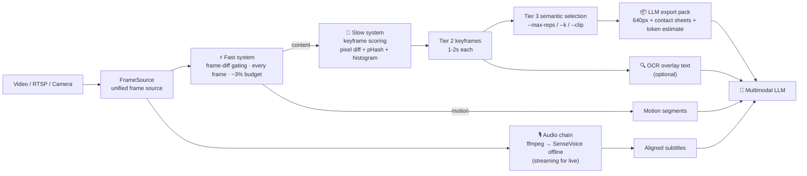

<div align="center">


English · [简体中文](README-CN.md) · [SKILL.md](SKILL.md) · [Benchmarks](bench/performance-test-results.md)

[](https://github.com/CommitStrip/video-understanding-skill/actions/workflows/ci.yml)
[](LICENSE)
[](https://github.com/CommitStrip/video-understanding-skill/tags)
[](https://github.com/CommitStrip/video-understanding-skill/actions)

**Compress video into what an LLM can actually read · 把视频压缩成 LLM 读得懂的样子**

</div>

---

vus compresses 30fps raw video (hundreds of thousands of frames) into **semantic representative frames + timeline-aligned subtitles + motion segments**, so a multimodal LLM can understand a video without missing key content. The same architecture covers **offline file transcription** (offline SenseVoice full-context recognition by default, grade-A Chinese readability) and **RTSP/camera live streams** (streaming recognition + trigger-based rolling VLM understanding, bounded latency).

<div align="center">

<br/><sub>▲ Real vus pipeline output — 30 semantic representative frames from an 11-minute Douyin explainer video (Tier 3, --max-reps 30)</sub>
</div>

## ✨ Core Features

- **Realtime budget allocation** — the fast system (per-frame motion gating, ~3% of compute) triggers the slow system (low-frequency keyframes + trigger-based heavy work). Runs directly on robots/edge devices, not just file replay.
- **Live understanding** — `vus.live`: a four-layer stack with millisecond local tagging + trigger-based rolling VLM understanding (cost knob included) + an SSE status service, built for realtime robot vision.
- **Unified frame sources** — video files / cameras / RTSP streams behind one `FrameSource` interface; RTSP ships latest-frame backpressure, auto-reconnect and monotonic-clock timestamps.
- **Three-tier compression** — raw frames → shot-level keyframes → semantic representative frames, solving the redundancy of "shot cuts ≠ content changes".
- **No frames lost to gradual drift** — slow content evolution such as slide annotations advancing or slow camera pans is captured by the drift-confirmation mechanism (hard window + sustained soft lane), not just hard cuts.
- **Dual-channel bilingual ASR** — file transcription defaults to the offline SenseVoice int8 model (full-context decoding, grade-A readability, robust to BGM); live audio uses the streaming zipformer channel (word-level timestamps). Missing models degrade explicitly — never silently faked.
- **LLM-friendly export** — representative frames auto-scaled to 640px + 3×3 contact sheets + token budget estimation; know the context cost before you run.
- **Optional semantic boost** — CLIP (ONNX, no PyTorch) semantic frame selection; OCR channel for embedded/overlay text.
- **GPU acceleration (v1.1)** — vendor-neutral `--device auto` across NVIDIA (CUDA), any Windows DX12 GPU (DirectML), and Apple Silicon (CoreML), with loud CPU fallback.
- **Installable, tested** — `pip install -e .`, 280+ pytest cases, GitHub Actions CI.

## 📦 Installation

```bash
pip install -e .                 # core (opencv-python + numpy)

# optional extras
pip install -e ".[asr]"          # sherpa-onnx ASR (real subtitles)
pip install -e ".[clip]"         # CLIP semantic selection (ONNX)
pip install -e ".[ocr]"          # OCR channel
```

Model weights are not committed to the repo; required models are auto-downloaded from the official sherpa-onnx release on first use:

| Channel | Model | Size | When downloaded |
|------|------|------|---------|
| File transcription (default) | SenseVoice int8 (zh/en, offline) | ~166MB | first pipeline run |
| Live audio (RTSP/camera) | streaming zipformer (zh/en) | ~490MB | first live run |
| CLIP semantic selection (optional) | ViT-B/32 ONNX | ~600MB | `--clip` / download script |

<details>
<summary>⏬ Manual download / disable auto-download / custom model dir</summary>

Set `VUS_ASR_AUTO_DOWNLOAD=0` to disable auto-download; model dirs can be overridden via
`VUS_SHERPA_MODELS` / `VUS_OFFLINE_ASR_MODELS` / `VUS_CLIP_MODELS`; manual download example:

```bash
mkdir -p models/sherpa
curl -L -o - https://github.com/k2-fsa/sherpa-onnx/releases/download/asr-models/sherpa-onnx-streaming-zipformer-bilingual-zh-en-2023-02-20.tar.bz2 \
  | tar -xj -C models/sherpa --strip-components=1
bash scripts/download_clip_onnx.sh   # CLIP ONNX
```
</details>

> ⚠️ Without models the subtitle channel degrades to **clearly-marked mock placeholder output — fake text, not real transcription**. Never deliver mock subtitles as real content.

## ⚡ GPU Acceleration (optional, v1.1)

CPU alone already runs at full speed (the vision chain hits 5.9× realtime — no GPU needed). For faster transcription and semantic selection, run the self-check first, then install one wheel per your hardware (the three onnxruntime wheels are mutually exclusive):

```bash
python -m vus.device   # prints your hardware, current engines and the exact install commands
```

| Your machine | Install | GPU coverage |
|------|------|------|
| NVIDIA (Win/Linux) | `pip install -e ".[gpu-nvidia]"` + the sherpa-onnx CUDA wheel (command in self-check output, ≈190MB) | ASR + CLIP + OCR * |
| AMD / Intel GPU (Win10+) | `pip install -e ".[directml]"` | CLIP + OCR |
| Mac (Apple Silicon) | standard wheel ships CoreML — nothing to install | CLIP |
| No GPU / other | nothing | all CPU (identical to v1.0) |

\* ASR over CUDA depends on the sherpa-onnx CUDA wheel: the upstream Windows wheel currently
fails to initialize (auto-falls back to CPU; measured in
[`bench/gpu/GPU_BENCHMARK.md`](bench/gpu/GPU_BENCHMARK.md)). Linux untested.

Enable with `--device auto` (supported by `integrated_pipeline`, `select_representatives --clip` and `vus.live`) or the `VUS_DEVICE=auto` environment variable. If the requested device is unavailable it falls back to CPU with a printed reason — no machine is excluded. The vision chain (OpenCV motion detection / keyframes) stays on CPU: pip OpenCV wheels have no CUDA build, and the measured 147fps shows it is not the bottleneck.

## 🚀 Quick Start

```bash
# 1. Extract structured artifacts (keyframes + motion segments + subtitles)
#    file transcription defaults to the offline SenseVoice channel
python -m vus.integrated_pipeline --video lecture.mp4 --output out/ --kf-hz 1.5

# with OCR (runs only on Tier 3 representative frames — never on the per-frame path)
python -m vus.integrated_pipeline --video lecture.mp4 --output out/ --ocr

# 2. Compress to semantic representative frames (Tier 3) and export the LLM pack:
#    640px-scaled frames + 3×3 contact sheets + token estimation
python -m vus.select_representatives --keyframes out/keyframes \
  --max-reps 60 --llm-export out/llm --out representatives.json --report context.md

# multi-person close-up rotation (round table / interviews)? keep in-bucket diversity:
python -m vus.select_representatives --keyframes out/keyframes \
  --interval 60 --k 3 --out representatives.json

# 3. Hand out/llm/ images + context.md + aligned_output.json to a multimodal LLM
#    (or just the text artifacts to a text-only LLM)
#    → course notes / plot summaries / scene-analysis reports
```

## 📡 Live Understanding (v0.4)

The offline pipeline solves "compress a video for an LLM to read"; `vus.live` solves "a live stream is coming in — the LLM understands while watching". A four-layer stack, each layer saturated to its own physical limit:

| Layer | Output | Latency | Cost |
|----|------|------|------|
| T0 frame reflex | motion events + boxes | 0ms (~1.6ms per frame) | zero (fast system) |
| T0.5 semantic tags | on-the-fly labels (faces, motion intensity…) | ms-level per frame | zero (local, no model download) |
| T2 rolling understanding | current summary/timeline/entities | bounded lag (VLM latency + trigger interval) | pay per call, trigger-based + floor interval |

> Millisecond-level semantics are handled by T0+T0.5; rich understanding is bounded below by VLM
> inference latency — the architecture guarantees **bounded lag that never grows**. While the VLM
> runs, material only accumulates (single-flight merging); the next window picks up the merged latest.

```bash
# file-as-realtime (default dev/acceptance path; mock backend runs the full chain for free)
python -m vus.live --video lecture.mp4 --realtime --vlm mock --serve

# RTSP live + real VLM (OpenAI-compatible env: VLM_API_BASE / VLM_API_KEY / VLM_MODEL)
python -m vus.live --source rtsp --url rtsp://host/stream --vlm openai --serve

# purely local free mode (T0+T0.5 only, zero API cost)
python -m vus.live --video x.mp4 --realtime --vlm off --serve
```

<details>
<summary>💰 Cost knobs and how to consume results</summary>

Cost knobs:

- **Trigger-based calls** — fired only on shot cuts / long motion-segment closure / new speech; silent scenes cost nothing;
- **Floor interval** `--min-call-interval` (default 8s) — worst-case cost = duration ÷ interval × per-call cost;
- **Slim calls** — latest 1-2 keyframes at 448px + incremental speech text + compressed motion stats;
- `--vlm off` — no calls at all.

Three ways to consume understanding (combinable):

- **Rolling files** — `live_state.json` (machine-readable) + `live_context.md` (human/agent-readable), atomically written; any agent can read current understanding at any time (plugs into the offline SKILL workflow);
- **SSE service** — with `--serve`: `GET /state` snapshot, `GET /events` incremental stream, `GET /healthz` probe;
- **Console** — periodic summary, per-layer lag and call telemetry.

Anti-bloat for long lives: when the understanding timeline overflows, the oldest entries are merged into a "previous context chapter" (pure text, zero VLM cost); speech segments and the label ring are bounded — memory does not grow with duration.
</details>

## 🏗️ How It Works



| Tier | Content | Magnitude | Purpose |
|------|------|--------|------|
| 0 | Raw frames | 30fps (10⁵ frames) | playback |
| 1 | Fast-system motion events | per frame | "did anything happen" |
| 2 | Shot-level keyframes | every 1-2s | timeline anchoring |
| 3 | **Semantic representative frames** | every 30-60s | **LLM understanding** |

Gradual-drift confirmation uses **two lanes**: the hard lane (over-threshold change accumulating N times in a sliding window) catches abrupt single-frame advances; the soft lane (under-threshold change sustained across a 30s window) covers the slow evolution left behind after "adoption resets the reference baseline" — perceptual hashing is blind to both.

## 📊 Performance

All numbers below are measured on a single machine, pure CPU; reproduction scripts live in `bench/`. The stress test ran in a cloud container (multi-core virtual cores, CPU only, no GPU); the full report is in
[`bench/real/BENCHMARK_REPORT.md`](bench/real/BENCHMARK_REPORT.md).

### Stress test — 45.5-minute 1080p30 concert recording (81,878 frames, 1.15GB)

| Metric | vus v0.4 | claude-real-video (baseline) |
|------|----------|--------------------------|
| Analysis load | **81,878 frames, every frame analyzed** | ~1,515 sampled frames (1.8s/frame) |
| End-to-end time | **581.7s (9.7 min)** | ≈19 min |
| Realtime factor | **4.7×** | ≈2.4× |
| Peak memory | **736MB**, flat curve | not measured |
| Dropped events | **0 / 59,556** | — |
| Keyframe density | 2,197 (48.3/min) | 60 (2.0/min) |
| ASR readability | **Grade A** simplified Chinese (SenseVoice int8 offline) | Grade C traditional Chinese, many homophone errors (whisper base) |
| LLM export | 41 frames @ 640px ≈ **13k tokens** | 60 frames @ 640px |

vus carries a **54× per-frame analysis load** and still finishes in about half the baseline's time.

### Real course (120-minute 1080p25 live class, ~180k frames)

| Metric | Result |
|------|------|
| Processing rate | 147.7fps (**5.9× realtime**) |
| Keyframes | 41 (35 gradual drift + 5 shot cuts), covering the full 0→7150s |
| ASR | 3,505 segments, ~33k characters, RTF 0.08 (parallel with the vision chain) |
| Memory | stable; ~225MB after the ASR model is released |

### Synthetic-video realtime factor (low-end 2-core Windows)

| Spec | Rate | Realtime factor |
|------|------|---------|
| 720p50 | 247fps | 4.9× |
| 1080p30 | 78fps | 2.6× |

### vs claude-real-video (crv)

Four 12-second synthetic clips + a two-level real-video comparison (see `bench/` to reproduce): on the `static` clip crv misses the ending flash entirely (0% coverage) while vus captures it with 2 frames; under the semantic protocol in `bench/semantic_eval/`, redundancy is **1.0 (4 frames / 4 scenes)** vs crv's 12.0 — the same coverage costs **12× less LLM context**.

### GPU acceleration measured (v1.1, RTX 3060 Laptop + Intel iGPU, Win11)

| Execution path (CLIP single frame, 823 real keyframes) | ms/frame | Throughput |
|---|---|---|
| CPU (baseline) | **16.0–16.7** | ~62 fps |
| DirectML @ RTX 3060 | 26.3–26.7 | ~38 fps |
| DirectML @ Intel Iris Xe iGPU | 25.7 (smoke) | ~39 fps |
| CUDA @ RTX 3060 | 34.5 | ~29 fps |

Honest conclusion: for **batch-1 CLIP inference the CPU is actually the fastest** (small model +
CPU↔GPU transfer overhead dominates) — machines with a strong CPU don't need the GPU; DirectML
is proven working on an Intel iGPU, which is exactly the path AMD/Intel GPU users take. ASR over
CUDA is currently blocked by the upstream sherpa Windows wheel, but the **automatic CPU fallback
is proven** (transcription identical after fallback). Full data, negative results and environment
notes in [`bench/gpu/GPU_BENCHMARK.md`](bench/gpu/GPU_BENCHMARK.md).

<details>
<summary>📖 Honest notes and comparison caveats</summary>

- The pixel-coverage metric shares its signal source with frame selection (the `static` conclusion stands independently);
- The stress test covers a single content domain (concert) on a single machine (CPU only); extrapolating to other domains needs more samples;
- crv officially pulls faster-whisper models online; our first run hit a TLS interruption and fell back to a locally cached whisper base — equivalent conditions;
- Reproduction scripts and the semantic evaluation protocol (annotation guide + coverage/redundancy metrics) are in `bench/`.
</details>

## 📁 Repository Structure

```
vus/                       installable core (pip install -e .)
  smart_pipeline.py        fast/slow dual-system vision chain
  integrated_pipeline.py   four-channel orchestration (vision + ASR + OCR + alignment)
  asr_sherpa.py            dual ASR channels: offline SenseVoice (file default) +
                           streaming zipformer (live), shared cleaning
  asr_clean.py             ASR output cleaning (loop collapse + dedup + hallucination flags)
  device.py                vendor-neutral device resolution + self-check (v1.1)
  select_representatives.py Tier 3 semantic selection (--k/--adaptive/--clip/--max-reps)
  llm_export.py            LLM-friendly export (640px scaling + contact sheets + token estimate)
  source.py                FileSource / CameraSource / RTSPSource
  clip_onnx.py             CLIP ViT-B/32 via onnxruntime (no torch)
  ocr_channel.py           optional OCR channel
  reconcile.py             ASR/OCR cross-modal cue annotation
  model_setup.py           model auto-download (official-source allowlist)
  io_utils.py, pathsafe.py safe file writes (path-traversal guarded)
  live/                    live understanding layer (v0.4)
    pipeline.py            four-layer orchestrator (python -m vus.live)
    understanding.py       trigger-based VLM worker (merge/compact/backoff)
    state.py               SessionState + atomic rolling persistence
    server.py              SSE state service (/state /events /healthz)
    tagger.py              T0.5 millisecond tagging channel
    vlm_client.py          VLM backend registry (openai/mock)
    audio_source.py        live audio chain (ffmpeg PCM → fixed-size blocks)
    events.py              bounded EventBus
    rolling_align.py       streaming aligner (incremental twin of batch alignment)
scripts/                   legacy command entries (thin shells, still work)
bench/                     crv comparison, real-video evidence reports, semantic eval protocol
docs/                      README visual assets (logo / demo image)
tests/                     pytest cases + end-to-end smoke (incl. file-as-live)
```

## 🤖 Using as an AI Skill

This repository is a ready-to-use agent skill: copy the whole directory into your agent's skill directory (e.g. `~/.agents/skills/video-understanding-skill/`) and the bundled `SKILL.md` teaches the agent when and how to run the pipeline — including model preparation and the mock-subtitle trap. No installation needed: the `scripts/` legacy entries carry their own path fallback.

## 💻 Hardware Footprint (measured)

2 cores / 4GB: the realtime vision chain uses ~1.2 cores + 166MB; Tier 3 offline selection ~317MB (memory-bounded); ASR decoding adds 300-500MB while running. Vision chain alone runs in 512MB; 2GB recommended with ASR. The 45.5-minute stress test peaked at 736MB including models.

## 🙏 Acknowledgments & Licensing

- [sherpa-onnx](https://github.com/k2-fsa/sherpa-onnx) — ASR engine
  (Apache-2.0). This repository only wraps it in `vus/asr_sherpa.py` /
  `vus/model_setup.py`. Model licenses differ: the streaming bilingual
  zipformer is Apache-2.0; the SenseVoice int8 weights are covered by the
  FunASR Model Open Source License Agreement v1.1 (use and redistribution
  allowed with source attribution and model-name retention; converted by
  k2-fsa from the ASLP-lab/WSYue-ASR SenseVoice fine-tune, base weights by
  FunAudioLLM / Alibaba). The fallback mirror
  [CommitStrip/vus-models](https://github.com/CommitStrip/vus-models) ships
  full `THIRD-PARTY-NOTICES.md` with license texts and per-package
  provenance. Follow the upstream terms for any redistribution or
  commercial use.
- [openai/CLIP](https://github.com/openai/CLIP) ViT-B/32 -- semantic encoder (MIT, ONNX export, optional; fetched from HuggingFace on demand, not redistributed here).
- [claude-real-video](https://github.com/HUANGCHIHHUNGLeo/claude-real-video) — comparison baseline for `bench/`.

## License

MIT © 2026
